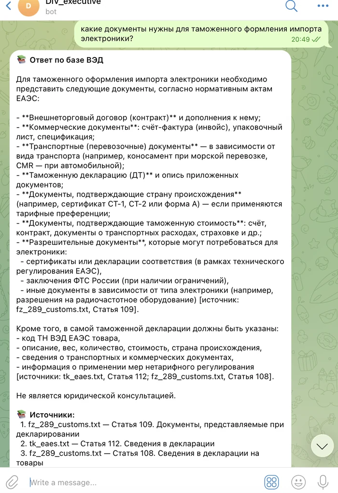
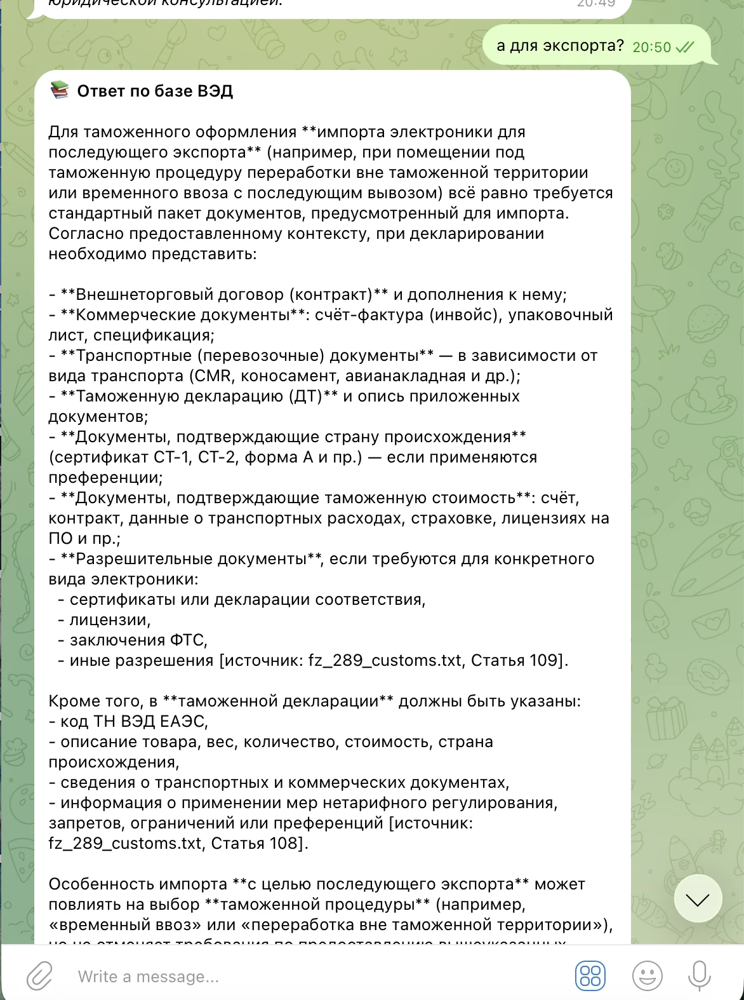
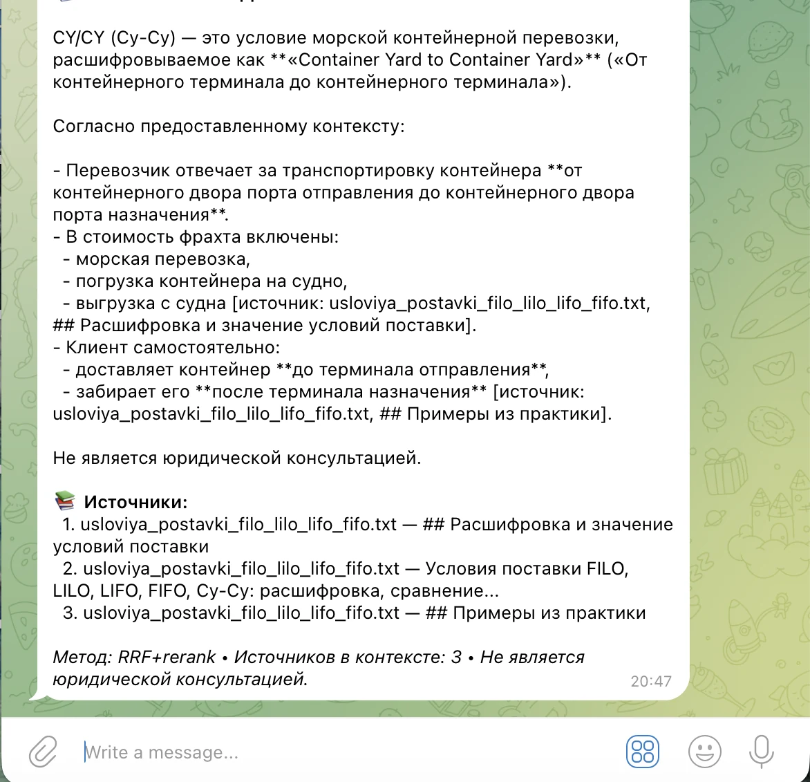
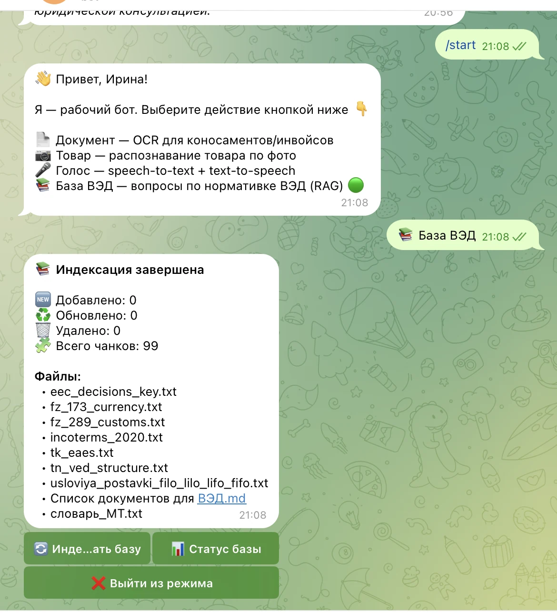
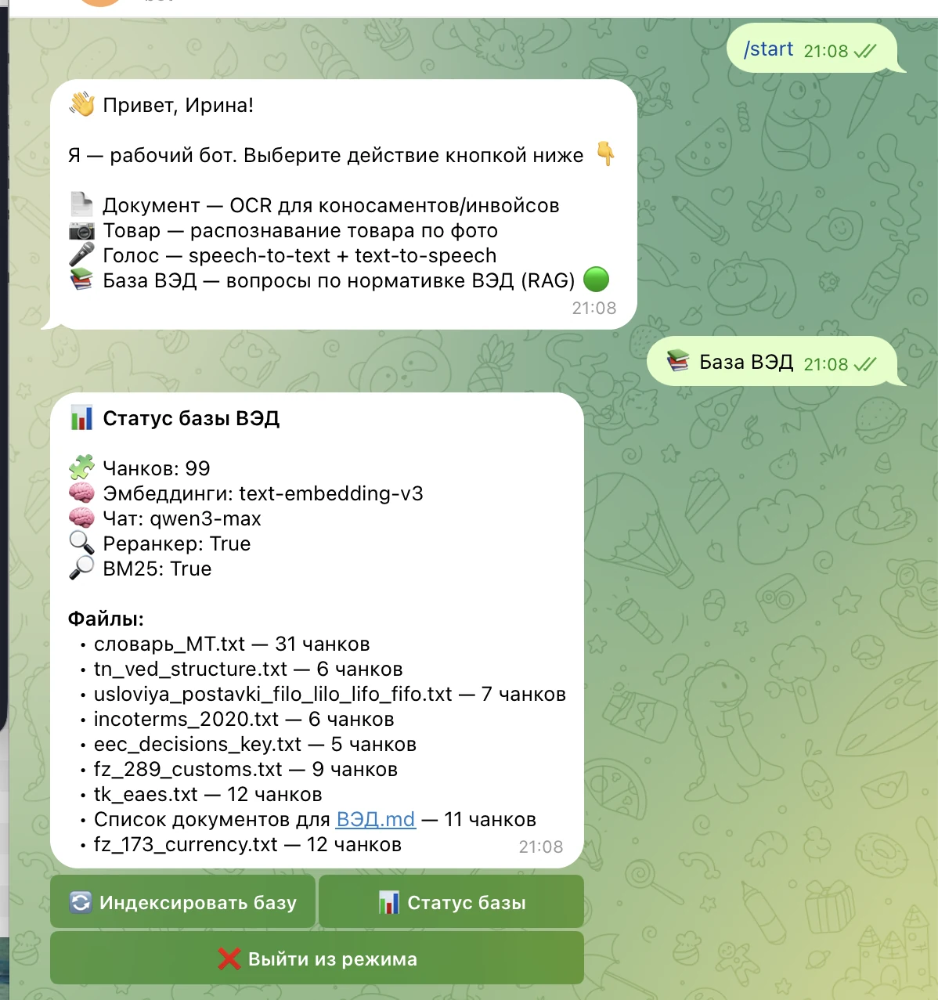

# Work Bot — ВЭД-ассистент на Telegram (OCR, vision, голос, RAG)

Telegram-бот-ассистент по внешнеэкономической деятельности (ВЭД). Обрабатывает документы, фото товаров, голосовые сообщения и отвечает на вопросы по нормативной базе ВЭД через RAG.

---

## Возможности

| Режим | Описание |
|---|---|
| 📄 **Документ** | Распознаёт сканы/фото документов (коносаменты, инвойсы, пакинг-листы) через Tesseract OCR. |
| 📷 **Товар** | Анализирует фото товара с помощью мультимодальной модели Qwen-VL. |
| 🎤 **Голос** | Распознаёт голос (Yandex SpeechKit STT) и синтезирует ответы (TTS). |
| 📚 **База ВЭД** | Отвечает на вопросы по нормативной базе ВЭД с цитатами из источников (RAG). |
| ℹ️ **Помощь** | Показывает справку по командам и режимам. |

---

## Стек и инструменты

### Язык и фреймворки
- **Python 3.10+**
- **python-telegram-bot** — взаимодействие с Telegram Bot API
- **asyncio** — асинхронная обработка сообщений

### Хранение состояния
- **SQLite** (`work_bot.db`) — логирование сессий и взаимодействий пользователей
- **in-memory `user_states`** — текущий режим пользователя и история диалога в режиме «База ВЭД»

### RAG-база знаний (`rag_engine.py`)
- **FAISS** — векторный индекс для семантического поиска (cosine similarity)
- **rank_bm25 (BM25Okapi)** — ключевой (лексический) поиск
- **RRF (Reciprocal Rank Fusion)** — объединение результатов dense + sparse поиска
- **DashScope / OpenAI-compatible API**:
  - `text-embedding-v3` — эмбеддинги чанков
  - `qwen-plus` — генерация ответа по контексту
  - `qwen3-rerank` (опционально) — реранкинг кандидатов

### OCR и документы
- **Tesseract OCR** — распознавание текста с изображений
- **Pillow / OpenCV** — предобработка изображений
- **pypdf** — чтение PDF-документов для RAG

### Голос
- **Yandex SpeechKit** — распознавание речи (STT) и синтез (TTS)

### Окружение
- **python-dotenv** — загрузка ключей и настроек из `.env`

---

## Структура проекта

```
work_bot/
├── work_bot.py              # Основной Telegram-бот, обработчики сообщений
├── rag_engine.py            # RAG-движок: индексация, поиск, генерация ответов
├── rag_data/
│   ├── docs/                # Исходные документы базы знаний (.txt, .md, .pdf)
│   ├── faiss_index.bin      # Векторный индекс
│   ├── metadata.json        # Метаданные чанков
│   └── manifest.json        # Контрольные суммы файлов
├── work_bot.db              # База SQLite с логами
├── .env                     # Переменные окружения (ключи API)
└── README.md                # Этот файл
```

---

## Установка и запуск

### 1. Клонирование / переход в папку

```bash
git clone https://github.com/ira-korshunova/work_bot.git
cd work_bot
```

### 2. Установка зависимостей

```bash
pip install -r requirements.txt
```

### 3. Установка Tesseract (macOS)

```bash
brew install tesseract
```

### 4. Настройка `.env`

Создай файл `.env` в корне проекта:

```env
WORK_BOT_TOKEN=your_telegram_bot_token
YANDEX_API_KEY=your_yandex_speechkit_key
API_KEY=your_dashscope_or_openrouter_key
BASE_URL=https://dashscope-intl.aliyuncs.com/compatible-mode/v1

# Пути к агентам (папки с document_extractor / vision-агентом) — опционально
DOC_AGENT_PATH=/path/to/doc_agent
VISION_AGENT_PATH=/path/to/vision_agent
# Путь к бинарникам Tesseract + Poppler — опционально
CONDA_BIN=/path/to/miniconda3/bin
TESSDATA_PREFIX=/path/to/miniconda3/share/tessdata
```

### 5. Запуск бота

```bash
python3 work_bot.py
```

---

## Работа с RAG-базой ВЭД

### Добавление документов

1. Положи текстовые файлы (`.txt`, `.md`) или PDF в папку `rag_data/docs/`.
2. Запусти индексацию одним из способов:
   - В боте нажми кнопку **«Индексировать базу»** в режиме «База ВЭД»
   - Или отправь команду `/ingest`
3. Бот пересоздаст векторное хранилище и начнёт использовать новые источники.

### Источники по умолчанию

В базе используются справочники и нормативные документы по темам:
- Таможенное оформление
- Валютный контроль
- Инкотермс 2020
- ТН ВЭД / ЕАЭС
- Документы для международных сделок

### Проверка статуса

Команда `/stats` или кнопка **«Статус базы»** покажет количество файлов и чанков.

---

## Контекст диалога

В режиме **«База ВЭД»** бот помнит последние сообщения в рамках сессии. Это позволяет задавать уточняющие вопросы, например:

> Пользователь: *Какие документы нужны для ВЭД?*  
> Бот: *[ответ со списком документов]*  
> Пользователь: *А для валютного контроля?*  
> Бот: *[понимает, что речь о документах для ВЭД, и уточняет ответ]*

История хранится в оперативной памяти (`user_states`) и сбрасывается при выходе из режима или перезапуске бота.

---

## Команды

| Команда | Описание |
|---|---|
| `/start` | Приветствие и выбор режима |
| `/help` | Справка по режимам |
| `/ask <вопрос>` | Задать вопрос по базе ВЭД без переключения режима |
| `/ingest` | Переиндексировать базу знаний |
| `/stats` | Статистика базы знаний |

---

## Особенности генерации ответов

- Ответы формируются **только на основе загруженной базы знаний**.
- Каждый ответ содержит ссылки на источники `[источник: <файл>, <заголовок>]`, когда информация найдена.
- Если ответа в базе нет, бот сообщает:  
  *«По имеющейся базе ответа не нашёл. Уточните вопрос или переиндексируйте документы (/ingest).»*
- В конце каждого ответа добавляется дисклеймер: *«Не является юридической консультацией.»*

---

## Скриншоты

**Диалог с памятью:** бот помнит контекст — сначала вопрос про импорт, затем «а для экспорта?» без повторного контекста, ответ со ссылками на источники:

<p align="center">
  
  
</p>

**Ответ по базе ВЭД (RAG):** вопрос на естественном языке, ответ строится только на загруженной базе знаний с цитатами `[источник: <файл>]`:

<p align="center">
  
</p>

**Управление базой знаний:** индексация документов и статистика — команды `/ingest` и `/stats`:

<p align="center">
  
  
</p>
